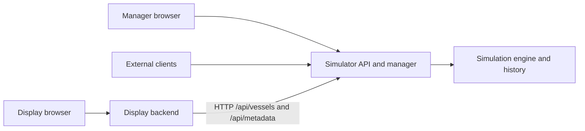

# AIS Test Bench

A local AIS simulator with a live vessel map and a manager UI. One random vessel
starts automatically in the North Sea off Rotterdam. The manager can set the fleet
to 0-100 vessels. Each vessel has a stable synthetic MMSI, a name, a vessel type,
and a random speed and course. Positions advance once per second at the reported
speed.

## Run

The combined command runs both components in one process:

```text
task run
```

Open [Manager](http://localhost:8000/manager) to adjust the vessel count and inspect
recent messages. Open [Display](http://localhost:8000/display) for the live map.
Both pages see the same simulation, including changes made in other browser tabs.

The components also run as separate processes. Use two terminals:

```text
task run:simulator
task run:display
```

The simulator serves the [manager](http://localhost:8000/manager) and its API. The
display serves the [map](http://localhost:8081/display) and reads the simulator at
`http://localhost:8000`. Start them in any order: the display page reports an
unreachable simulator, retries, and replaces its map after a simulator restart.

| Command | Flags and defaults | Routes |
| --- | --- | --- |
| `go run ./cmd/ais-test-bench` | `-addr localhost:8000` | `/`, `/manager`, `/display`, `/status`, `/api/*`, `/display/api/*` |
| `go run ./cmd/simulator` | `-addr localhost:8000` | `/` (redirects to `/manager`), `/manager`, `/status`, `/api/*` |
| `go run ./cmd/display` | `-addr localhost:8081`, `-simulator-url http://localhost:8000` | `/` (redirects to `/display`), `/display`, `/display/api/*` |

Listen addresses need an explicit host. The simulator URL is an http or https
origin without user info, path, query, or fragment. Each process serves
`/static/*` for its pages.

The display uses Leaflet 1.9.4 and OpenStreetMap tiles. The browser needs internet
access to load Leaflet and map tiles. Application templates, CSS, JavaScript, and
htmx are embedded in the executables. No Node build is required.

```text
task all
```

Development checks use the Go version in `go.mod`, Task, PowerShell,
golangci-lint, deadcode, and gotestsum. Dependencies are vendored.

## Architecture

The simulator component owns vessel movement, AIS generation, authoritative
state, recent message storage, its HTTP API, and the manager page. The display
component owns its HTTP backend, a simulator HTTP client, AIS decoding for the
map, and the live page. Browsers call only the origin that served their page;
the display backend reads the simulator server-side.



In combined mode, `internal/app` creates one engine and mounts its API on the
public listener and on a private `127.0.0.1` listener with an OS-assigned port.
The display client reads that private listener, so the display consumes NMEA over
HTTP in both modes and never reads engine state.

| Package | Responsibility |
| --- | --- |
| `simulation` | Public engine: random fleet, movement, AIS encoding, latest reports, recent message history, metadata |
| `internal/app` | Combined composition: one engine, public and private API listeners, display, shutdown order |
| `internal/simulator` | Simulator HTTP API with engine-to-wire conversion, standalone manager routes, engine and HTTP lifecycle |
| `internal/simulation` | Real-time driver: run identity, wall-clock ticks, delegation to the public engine |
| `internal/simulatorapi` | JSON wire types and documented simulator API contract |
| `internal/display` | Simulator HTTP client, NMEA-derived projection, display API, standalone lifecycle |
| `internal/ais` | Encode and decode AIS type 1 position reports; validate NMEA with go-nmea |
| `internal/ui` | Stateless HTML pages with component-specific navigation, embedded assets |
| `internal/httpserver` | Shared HTTP server settings and bounded shutdown |
| `internal/cli` | Shared listen address validation |

Other Go programs can import the engine directly as
`github.com/miroslav-matejovsky/ais-test-bench/simulation` to generate the same
traffic without a server. It uses only caller-supplied timestamps and seeds, and
returns detached copies of its fleet, history, and metadata. See its package
documentation and example.

The simulator creates a report immediately for every new vessel and after each
one-second movement tick. Reports contain MMSI, position, speed, course, heading,
and UTC seconds, framed as checksummed `!AIVDM` sentences with CRLF. The small
codec uses [go-nmea](https://github.com/adrianmo/go-nmea) to validate each sentence.
The simplified fixed cadence supports live development.

The latest 1,000 reports are retained in memory, oldest first. Reducing the fleet
removes active vessels while preserving retained reports. Setting the count to
zero stops message generation. Restarting resets the fleet and all history and
starts a new simulation identity.

The original domain/application contract subpackages and the targets, networking,
management, and visualization folders remain as design scaffolding. The running
scenario uses the concrete packages above. TCP/UDP publishing, playback,
additional message types, and route planning are future design work.

## Simulator API

Any HTTP client can poll the simulator. JSON responses use `Cache-Control: no-store`.

| Method | Path | Response / input |
| --- | --- | --- |
| GET | `/api/vessels` | `{ "simulationId": "...", "updatedAt": "...", "messageCount": 1, "messageLimit": 1000, "vessels": [...] }` |
| PUT | `/api/vessels` | Accepts `{ "count": 3 }`; returns the resulting fleet |
| GET | `/api/messages` | `{ "simulationId": "...", "messageLimit": 1000, "oldestSequence": 1, "latestSequence": 1, "messages": [...] }` |
| GET | `/api/metadata` | Run identity and start, vessel type catalog, supported AIS message types, effective settings |

```text
curl http://localhost:8000/api/metadata
curl http://localhost:8000/api/vessels
curl -X PUT -H "Content-Type: application/json" -d '{"count":3}' http://localhost:8000/api/vessels
```

A fleet vessel is `{ "mmsi": ..., "name": "...", "typeId": "cargo", "report": {
"sequence": 1, "timestamp": "...", "sentence": "!AIVDM,...\r\n" } }`. Navigation
data is only in the NMEA sentence. A history message is `{ "sequence": 1,
"mmsi": ..., "timestamp": "...", "sentence": "..." }`; bounds are `null` for an
empty history. Sequences restart with every new `simulationId`. See
`internal/simulatorapi` for the full contract and polling guidance.

`PUT` requires `Content-Type: application/json` and an integer count from 0 to 100.
Malformed input returns 400; other content types return 415; other methods
return 405. An empty fleet is an empty JSON array.

## Display API

`GET /display/api/vessels` returns `{ "simulationId": "...", "updatedAt": "...",
"spawnBounds": { "south": 52, "north": 52.04, "west": 3.94, "east": 4 },
"vessels": [...] }`. A vessel has `mmsi`, `name`, `typeId`, `typeName`,
`latitude`, `longitude`, `speed` (knots), `course` and `heading` (degrees), and
`updatedAt` (UTC report time). Navigation values are decoded from the latest NMEA
report and are `null` when AIS marks them unavailable.

Each request reads the simulator fleet and metadata concurrently with a
five-second deadline. An unreachable simulator, a timeout, or a restart between
the two reads returns 503. Invalid simulator JSON, metadata, or AIS returns 502.
The page then keeps its last markers, shows that updates are unavailable, and
retries. A new `simulationId` clears the map before the new fleet is drawn.

Movement follows the current speed and course over the earth's surface. Random
starting positions are offshore; this first scenario has no coastline avoidance.
