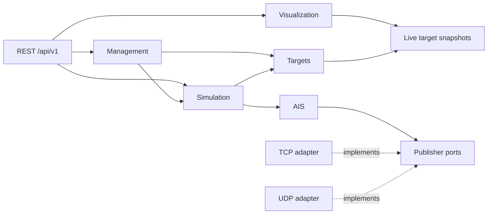

# AIS Test Bench

AIS Test Bench is a local AIS simulation and testing environment for development,
integration, and demonstrations. The design generates synthetic vessel traffic
and publishes AIS/NMEA over TCP and UDP. It uses no RF transmission.

This repository is an initial architecture scaffold. Go packages contain domain
values, public interfaces, configuration structs, and embedded UI placeholder
assets. The executable reports scaffold status. Runtime services, REST behavior,
and interactive frontends are intentionally left for implementation.

## Architecture

One executable, `cmd/ais-test-bench`, owns HTTP, REST, two frontends, simulation,
and TCP/UDP publishing in a single process. A modular monolith keeps deployment
local while preserving six DDD-inspired boundaries:

| Context | Ownership |
| --- | --- |
| Simulation | Scenarios, lifecycle, virtual time, playback, tick orchestration |
| AIS | Report generation, encoding, NMEA framing, publication contracts |
| Targets | Vessels, navigation, tracks, deterministic movement models |
| Networking | TCP clients, UDP destinations, bounded queues, socket lifecycle |
| Management | Validated scenario/target CRUD, simulator control, system configuration/status |
| Visualization | Target projections, selection queries, local chart abstraction |



The diagram shows runtime collaboration. Compile-time dependencies point inward:
infrastructure implements application ports, application uses domain values, and
domain packages use only the standard library. Cross-context mappings live in
application-facing adapters. `internal/app` is the composition root.

Interfaces live near consumers. Domain objects carry no HTTP, persistence, socket,
or frontend dependencies. Admin and viewer share use cases and consistent
snapshots through the API. The simulator alone controls virtual time. Direct
calls handle the main traffic pipeline; a typed in-process event bus is reserved
for lifecycle notifications.

## Endpoints and frontends

| Endpoint | Purpose |
| --- | --- |
| /admin | Independent management UI: scenarios, targets, controls, system status |
| /viewer | Independent viewer: charts, targets, AIS labels, selection, playback |
| /api/v1 | Versioned JSON REST API |
| /healthz | Operational health |
| /metrics | Prometheus metrics |

Two React builds are the initial frontend direction, with independent
`web/admin/assets` and `web/viewer/assets` distributions embedded using `embed.FS`.
Node is needed only when building frontends. HTMX + Templ is a documented
alternative. See [web](web/README.md).

## Project guide

- [Complete directory tree](docs/tree.md)
- [Every package, interface, responsibility, and dependency](docs/packages.md)
- [Bootstrap sequence, example main.go, router setup, graceful shutdown](docs/startup.md)
- [Configuration schema and example config.yaml](configs/README.md)
- [Recommended dependencies and sources](docs/dependencies.md)
- [Unit, integration, and simulation testing](test/README.md)
- [Deployment model](deployments/README.md)

## Development

Use the Go version declared in `go.mod`. The scaffold has no third-party runtime
dependencies. Existing checks use Task, PowerShell, golangci-lint, deadcode, and
gotestsum.

```text
go build ./cmd/ais-test-bench
go run ./cmd/ais-test-bench
task all
```

The first two commands build/run the status-only scaffold. The future executable
will load `config.yaml`; [configs/config.yaml](configs/config.yaml) documents
loopback HTTP/TCP and an explicit local UDP destination.

Production concerns are part of the contracts: early validation, bounded queues,
finite I/O deadlines, deterministic time, startup rollback, structured errors,
observable connection failures, and bounded shutdown. Concrete behavior and its
tests remain listed in [.todo](.todo).
