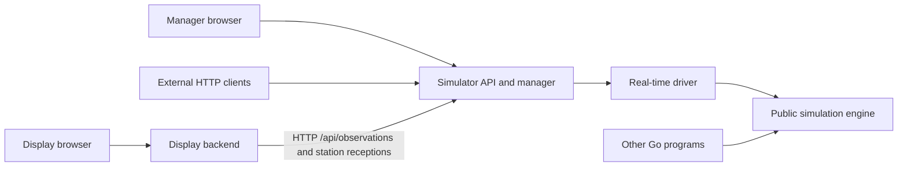

# AIS Test Bench

A local AIS simulator with a live vessel map and a manager UI. One random vessel
starts automatically in the North Sea off Rotterdam. The manager can set the fleet
to 0-100 vessels. Each vessel has a stable synthetic MMSI, a name, a vessel type,
and a random speed and course. Every vessel reports once per second of simulation
time. The manager sets how fast simulation time passes, from 0.01x to 100x, or
pauses it; vessels keep their reported speed in knots.

## Run

The combined command runs both components in one process:

```text
task run
```

Open [Manager](http://localhost:8000/manager) to adjust the vessel count and
simulation speed and to inspect recent messages. Open
[Display](http://localhost:8000/display) for the live map. Both pages see the same
simulation, including changes made in other browser tabs. Both show the virtual
UTC simulation time and speed separately from when the page last received data.

The manager also creates, edits, disables, and deletes up to 16 AIS receiving
stations. Three synthetic sites start with different antenna heights, sensitivities,
and coverage. Expand the station editor to configure A/B channels and directional
shadow losses. The "Disable B preset" applies a channel failure through the same
station API. Concurrent edits preserve your draft and require review before retrying.

The components also run as separate processes. Use two terminals:

```text
task run:simulator
task run:display
```

The simulator serves the [manager](http://localhost:8000/manager) and its API. The
display serves the [map](http://localhost:8081/display) and reads the simulator at
`http://localhost:8000`. Start them in any order: the display page reports an
unreachable simulator, retries, and replaces its map after a simulator restart.

| Command | Flags and defaults | Routes |
| --- | --- | --- |
| `go run ./cmd/ais-test-bench` | `-addr localhost:8000` | `/`, `/manager`, `/display`, `/status`, `/api/*`, `/display/api/*` |
| `go run ./cmd/simulator` | `-addr localhost:8000` | `/` (redirects to `/manager`), `/manager`, `/status`, `/api/*` |
| `go run ./cmd/display` | `-addr localhost:8081`, `-simulator-url http://localhost:8000` | `/` (redirects to `/display`), `/display`, `/display/api/*` |

Listen addresses need an explicit host. The simulator URL is an http or https
origin without user info, path, query, or fragment. Each process serves
`/static/*` for its pages.

The display uses Leaflet 1.9.4 and OpenStreetMap tiles. The browser needs internet
access to load Leaflet and map tiles; observation tables still work if either
cannot load. Application templates, CSS, JavaScript, and
htmx are embedded in the executables. No Node build is required.

```text
task all
```

Development checks use the Go version in `go.mod`, Task, PowerShell,
golangci-lint, deadcode, gotestsum, and go-arch-lint. `task go-tools` installs
the Go tools. Dependencies are vendored.

## Architecture

The simulator component owns vessel movement, AIS generation, authoritative
state, recent message storage, its HTTP API, and the manager page. The display
component owns its HTTP backend, a simulator HTTP client, validation and AIS
decoding of received observations, and the live page. Browsers call only the origin that served their page;
the display backend reads the simulator server-side.



Both applications and other Go programs use the same engine implementation. In
the applications, the real-time driver is its only mutator. In combined mode,
`internal/app` creates one engine and driver and mounts the API on the public
listener and on a private `127.0.0.1` listener with an OS-assigned port. The
display client reads that private listener, so the display consumes NMEA over
HTTP in both modes and never reads engine state.

Packages, their responsibilities, and their allowed dependencies are defined in
[`.go-arch-lint.yml`](.go-arch-lint.yml) and enforced by `task arch-lint`.

The simulator creates a report immediately for every new vessel and at every
one-second virtual tick. Reports contain MMSI, position, speed, course, heading,
and UTC seconds, framed as checksummed `!AIVDM` sentences with CRLF. Each vessel
alternates between AIS channels A and B. The small
codec uses [go-nmea](https://github.com/adrianmo/go-nmea) to validate each sentence.
The application starts virtual time at the real startup instant and delivers
measured wall-clock time every 100 ms of real time at the current speed, 1x by
default, so report timestamps follow real time until the speed changes. A count
or speed change first settles elapsed time at the previous speed. A backlog of
more than one virtual hour, for example after the host was suspended, stops the
simulator instead of replaying it. At 100x that is 36 real seconds. HTTP
deadlines, shutdown, and page polling always use real time.

At 100 vessels and 100x the simulator emits 10,000 reports per real second, so
the 1,000 retained reports cover about 0.1 real seconds. HTTP clients detect
missed reports from sequence gaps; Go programs receive complete batches.

The published limits are measured, not assumed. On an Intel Core Ultra 7 265H
with Go 1.27.1, one virtual second at 100 vessels and 16 stations that receive
every report takes about 2.1 ms with full histories and 1,000 observed targets,
and 7.9 ms when all 100 MMSIs are replaced every second. Both stay below the
10 ms that 100x allows. The largest observation snapshot, 16 stations and 1,000
targets, encodes to 5.2 MiB, under the display's 8 MiB bound; one display request
at that size takes about 180 ms. Rerun with
`go test ./simulation ./internal/app -run '^$' -bench . -benchmem`.

The latest 1,000 reports are retained in memory, oldest first. Reducing the fleet
removes active vessels while preserving retained reports. Setting the count to
zero stops message generation. Restarting resets the fleet and all history and
starts a new simulation identity.

TCP/UDP publishing, playback, additional message types, and route planning are
future design work.

## Go package

Other Go programs import the engine to generate the same traffic without a
server, network, or UI:

```go
import "github.com/miroslav-matejovsky/ais-test-bench/simulation"

sim, err := simulation.New(simulation.Config{
    ID:                 "test-run",
    StartTime:          time.Date(2030, 1, 2, 3, 4, 5, 0, time.UTC),
    Seed:               42,
    InitialVesselCount: 2,
    Speed:              1,
    Transmitter:        simulation.TransmitterProfile{PowerWatts: 12.5, HeightMeters: 10, GainDBi: 2, FeederLossDB: 1},
    Stations:           nil, // 0-16 receiving stations
})
if err != nil {
    return err
}
initial := sim.History().Messages                // 2 creation reports at StartTime
reports, err := sim.Advance(ctx, 5*time.Second) // 10 reports at 03:04:06-03:04:10
if err != nil {
    return err
}
for _, report := range reports {
    decode(report.Sentence) // "!AIVDM,1,1,,A,...*hh\r\n", channel A or B
}
```

- **Config:** every field is explicit; seed, count, and speed 0 are valid values,
  not defaults. The ID must be nonempty. `StartTime` must be nonzero and within
  years 1-9999 and is normalized to UTC. Count is 0-100. `Transmitter` is the
  reference transmitter all vessels use and has no default.
- **Stations:** `Config.Stations` holds 0-16 synthetic receiving sites: position,
  antenna height, gain, feeder loss, channel A/B sensitivity and impairment, and
  up to 8 shadow sectors. `AddStation`, `UpdateStation`, and `RemoveStation` take
  the expected `Stations().Revision`; errors wrap `ErrInvalid`, `ErrConflict`,
  `ErrNotFound`, or `ErrLimit`. IDs are never reused. Name-only edits keep the
  RF revision. Stations do not change vessel reports. Station latitude is
  limited to -85 to 85.
- **Reception model:** one deterministic link budget with a radio horizon gives
  each station channel a receive probability for the reference transmitter.
  Its fixed parameters are in `Metadata().Settings.Reception`; they are
  test-bench choices, not calibrated predictions. Each station carries 90% and
  50% coverage rings per channel from the same model.
  The application starts with three demonstration sites, documented in
  `internal/simdriver`.
- **Receptions:** every report is evaluated at every station. `Observations(stationIDs)`
  returns one consistent snapshot of what the selected stations actually
  received: per-station counters and 60-second rates, one target per MMSI built
  only from received reports, and the newest 50 receptions. Targets are fresh
  up to 10 s, stale up to 60 s, then lost until removed at 600 s of virtual age;
  at most 1,000 MMSIs are kept, evicting the oldest. `ReceptionHistory` pages
  through the newest 1,000 receptions per station and reports gaps. Transmission
  sequences and per-station reception sequences are separate identities.
- **Messages:** `SetCount` returns the creation reports; `Advance` and `Elapse`
  return every report they emit, in sequence order, as `Message{Sequence, MMSI,
  Timestamp, Sentence}`. Sentences are checksummed type 1 `!AIVDM` lines with
  CRLF whose UTC second comes from the full virtual `Timestamp`.
- **Time:** `Advance(ctx, d)` adds exactly `d` of virtual time. `Elapse(ctx, d)`
  adds real `d` multiplied by the speed, carrying sub-nanosecond remainders, so
  split calls equal one combined call. Reports fall on every virtual second after
  `StartTime`. One call covers at most 60 virtual seconds (6,000 reports at 100
  vessels); split longer periods.
- **Speed:** 0 pauses `Elapse` and drops the real time, with no catch-up after
  resuming. Otherwise speed is 0.01-100 in 0.01 steps. `Advance` still works while
  paused. Speed never changes the knots vessels report.
- **History:** `History` keeps only the latest 1,000 reports. Returned batches are
  complete; a gap between the last sequence you processed and
  `History().OldestSequence` means reports were lost from history.
- **Atomicity:** a failed call returns no reports and changes nothing, including
  random state, clock, and remainder. A context is checked before and between
  ticks. Errors wrap `ErrInvalid` for rejected input and `ErrLimit` for exceeded
  limits.
- **Caller responsibility:** the package reads no clock, sleeps, or starts
  goroutines. Callers pace real time, for example by passing measured durations
  to `Elapse` as the test bench does every 100 ms, and order their commands. The
  same config and ordered calls reproduce the same bytes; methods are safe for
  concurrent use, but concurrent callers get no deterministic order.

The runnable examples cover initial creation, batches, stepping, speed scaling,
pause, station edits, and observations: `go doc -all ./simulation`.

## Simulator API

Any HTTP client can poll the simulator. JSON responses use `Cache-Control: no-store`.

| Method | Path | Response / input |
| --- | --- | --- |
| GET | `/api/vessels` | `{ "simulationId": "...", "updatedAt": "...", "messageCount": 1, "messageLimit": 1000, "vessels": [...] }` |
| PUT | `/api/vessels` | Accepts `{ "count": 3 }`; returns the resulting fleet |
| GET | `/api/messages` | `{ "simulationId": "...", "messageLimit": 1000, "oldestSequence": 1, "latestSequence": 1, "messages": [...] }` |
| GET | `/api/metadata` | Run identity, virtual start and `time`, vessel type catalog, supported AIS message types, effective settings |
| PUT | `/api/time` | Accepts `{ "speed": 2 }`; returns the resulting metadata |
| GET | `/api/stations` | Atomic station configuration, clock, settings, and revisions |
| POST | `/api/stations` | Complete definition plus expected `simulationId` and `stationSetRevision`; returns 201 with `stationId` and resulting configuration |
| PUT | `/api/stations/{id}` | Replace definition using expected run and station-set revision |
| DELETE | `/api/stations/{id}` | Expected `simulationId` and `stationSetRevision` query parameters; returns resulting configuration |
| GET | `/api/observations?stations=all` | Atomic received targets, station capabilities/coverage/counters, and newest 50 receptions; accepts a union of station IDs |
| GET | `/api/stations/{id}/receptions?simulationId=...` | Newest 100 successful receptions; optional `after` cursor and `limit` of 1-200 |

```text
curl http://localhost:8000/api/metadata
curl http://localhost:8000/api/vessels
curl -X PUT -H "Content-Type: application/json" -d '{"count":3}' http://localhost:8000/api/vessels
curl -X PUT -H "Content-Type: application/json" -d '{"speed":0}' http://localhost:8000/api/time
```

All simulation timestamps are virtual UTC instants starting at `startedAt`.
Metadata `time` is the committed virtual clock: `{ "now": "...", "elapsedMs":
5000, "speed": 1, "paused": false }`. Speed changes how fast virtual time passes,
not the knots vessels report. A count or speed change first settles elapsed time
at the previous speed. Each response is a separate snapshot, so a report can be
slightly newer than a `time.now` read earlier.

A fleet vessel is `{ "mmsi": ..., "name": "...", "typeId": "cargo", "report": {
"sequence": 1, "timestamp": "...", "sentence": "!AIVDM,...\r\n" } }`. Navigation
data is only in the NMEA sentence. A history message is `{ "sequence": 1,
"mmsi": ..., "timestamp": "...", "sentence": "..." }`; bounds are `null` for an
empty history. Sequences restart with every new `simulationId`. See
`internal/simulatorapi` for the full contract and polling guidance.

`PUT` requires `Content-Type: application/json` and either an integer count from
0 to 100 or a speed of 0 (pause) or 0.01 to 100 in 0.01 steps. Malformed input
returns 400; other content types return 415; other methods return 405; a valid
change the simulator cannot apply returns 500. An empty fleet is an empty JSON
array.

Station writes require every definition field, including zero/false values and
empty `shadowSectors`. Their body limit is 64 KiB; an encoded definition is at
most 4 KiB. New routes return JSON errors: 400 invalid input, 404 missing station,
409 stale run/revision, 413 oversized body, 415 wrong content type, or 500 for an
application failure. Rejected identities and invalid edits do not settle time.
Valid writes settle first and return their exact post-command configuration.

New reception sequences, counters, and revisions are decimal JSON strings to
preserve uint64 precision. Reception sequences are independent per station;
`transmissionSequence` identifies the original generated report. History responses
include `nextAfter`, `hasMore`, `gap`, retained bounds, and `truncatedBefore`.
Polling can miss retained events, especially at high speed. Recover current
received targets through `/api/observations`; these survive reception-history gaps.

Observation targets contain only received NMEA navigation, with per-station last
receipt provenance. Scenario names/categories remain separately identified. Coverage
is estimated GeoJSON MultiPolygon for the published reference transmitter, with
90% and 50% contours per channel, split at the antimeridian. Signal power/margin
are model estimates. See `internal/simulatorapi` package documentation for complete
request examples, field units, selection, retention, and lifecycle rules.

## Display API

The display shows only AIS targets that base stations actually received. A vessel
no station hears is not drawn, and a missed report leaves the last received
position. The page shows fresh targets, mutes stale ones, and hides lost ones
unless the lost-target layer is enabled. Choose one or several stations to see
their received-target union. The map shows each site's estimated 90% and 50%
coverage for channel A or B, with separate station and coverage layer controls.
Initial framing includes stations and received positions; "Fit coverage" frames
the larger RF area. Later polls preserve the map view.

Station comparison and detail panels show receiver settings, coverage assumptions,
and simulation diagnostic counters. Fresh/stale splits and last-seen timestamps
come from retained observations of selected sites; unselected sites show their
combined current count. Target details show AIS navigation and receiver provenance;
choosing an older receiver report fetches that station's last received position.

The signal inspector shows the recent selection sample or one station's paged
history. It retains at most 200 rows plus the message explicitly opened for reading.
MMSI filtering applies to this loaded sample. History gaps show retained sequence
bounds; pausing the inspector leaves main observation polling active. Message
details retain reception-time receiver settings and copy the exact checksummed
NMEA, including CRLF. The standalone page links to its configured simulator manager.

| Method | Path | Response |
| --- | --- | --- |
| GET | `/display/api/observations?stations=all` | Validated snapshot: clock, settings, stations with coverage and counters, decoded targets with provenance, recent receptions; accepts distinct station IDs |
| GET | `/display/api/stations/{id}/receptions?simulationId=...` | Validated, decoded station history page; optional `after` cursor and `limit` of 1-200 |

A target is `{ "mmsi": ..., "ageMs": ..., "status": "fresh", "report": {...},
"stations": [...] }`. The report is the chosen reception: `stationId`, decimal
string `sequence` and `transmissionSequence`, `channel`, `receivedAt`, raw
`sentence`, `navigation` (`latitude`, `longitude`, `speed` in knots, `course`,
`heading`, `utcSecond`; `null` when unavailable), `scenario` labels, the
reception-time `receiver` configuration, and the estimated `signal` with
`estimatedPowerDbm`. Provenance marks which stations received the chosen
transmission. Scenario names and categories are simulator labels, not AIS data.

Each request performs one simulator read with a five-second deadline and bounds
the body to 8 MiB for observations and 2 MiB for history. It validates the whole
contract before answering: identities, clock, revisions, canonical decimal
strings, station configuration, counters, coverage geometry, references, ages,
and NMEA framing, checksum, type, channel, MMSI, and UTC second. Malformed display
queries return 400, an unknown station 404, and a history request from another
run 409. An unreachable simulator or a timeout returns 503; any invalid simulator
response returns 502. The page then keeps its last complete view, marks the entire
view stale, shows that updates are unavailable, and retries. A new `simulationId`
clears markers, selections, details, and history cursors before drawing the new run.
See `internal/display` package
documentation for the full validation rules.

Movement follows the current speed and course over the earth's surface. Random
starting positions are offshore; this first scenario has no coastline avoidance.
