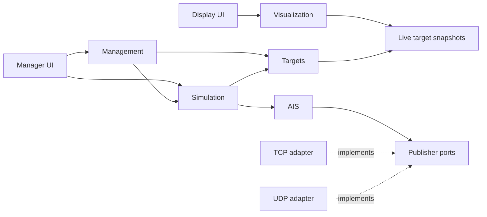

# AIS Test Bench

AIS Test Bench is a local AIS simulation and testing environment for development,
integration, and demonstrations. The design generates synthetic vessel traffic
and publishes AIS/NMEA over TCP and UDP. It uses no RF transmission.

This repository is in the design phase. The executable starts an HTTP server with
placeholder Manager and Display UIs. Bounded contexts contain domain values and
public interfaces; runtime services are not implemented yet.

## Architecture

One executable, `cmd/ais-test-bench`, owns HTTP, both UIs, simulation, and TCP/UDP
publishing in a single process. A modular monolith keeps deployment local while
preserving six DDD-inspired boundaries:

| Context | Ownership |
| --- | --- |
| Simulation | Scenarios, lifecycle, virtual time, playback, tick orchestration |
| AIS | Report generation, encoding, NMEA framing, publication contracts |
| Targets | Vessels, navigation, tracks, deterministic movement models |
| Networking | TCP clients, UDP destinations, bounded queues, socket lifecycle |
| Management | Validated scenario/target CRUD, simulator control, system status |
| Visualization | Target projections, selection queries, local chart abstraction |



The diagram shows runtime collaboration. Compile-time dependencies point inward:
infrastructure implements application ports, application uses domain values, and
domain packages use only the standard library. Cross-context mappings live in
application-facing adapters. `internal/app` is the composition root.

Interfaces live near consumers. Domain objects carry no HTTP, persistence, socket,
or UI dependencies. Manager and Display share use cases and consistent snapshots.
The simulator alone controls virtual time. Direct calls handle the main traffic
pipeline; a typed in-process event bus is reserved for lifecycle notifications.

## User interfaces

| Route | Purpose |
| --- | --- |
| /manager | Manager: scenarios, targets, simulator control, system status |
| /display | Display: charts, targets, AIS labels, selection, playback |

Both UIs are server-rendered with `html/template` and htmx 4, in `internal/ui`.
Templates, CSS, and a vendored htmx build are embedded in the binary, so no Node
toolchain is needed. See [startup](docs/startup.md) for routes and rendering rules.

## Development

Use the Go version declared in `go.mod`. Checks use Task, PowerShell,
golangci-lint, deadcode, and gotestsum.

```text
task run                                          # http://localhost:8080
go run ./cmd/ais-test-bench -addr localhost:9000  # http://localhost:9000
task all
```

`-addr` (host:port) is the only parameter. The host is required, so the server
never binds all interfaces by accident.

Production concerns are part of the contracts: early validation, bounded queues,
finite I/O deadlines, deterministic time, structured errors, observable connection
failures, and bounded shutdown. Remaining work is listed in [.todo](.todo).
