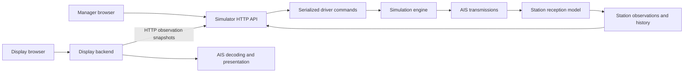

# Multiple AIS base stations

Status: in progress. Prepared 2026-09-14. Steps 01 (station configuration), 02
(reception and coverage model), and 03 (engine observations) are implemented;
steps 04-07 are future work.
The "Current implementation" section describes the code before step 01. As a
proof of concept, the model has no version: it is replaced in place when it
changes, and its parameters are fixed engine constants published in metadata.
Station latitude is limited to [-85, 85] instead of handling polar coverage.

## Goal and value

Simulate multiple shore receiving sites with different coverage and receiving
capabilities. Let users see why a station receives some AIS reports and misses
others, compare overlapping sites, inspect received signals, and follow each
station's observed targets. Preserve separate simulator and display components,
including separate process operation and the HTTP boundary in combined mode.

"Base station" in this delivery means the receiving side of a synthetic shore
site. A station has an application ID, location, receiver configuration, reception
history, and observed targets. Full AIS base station transmissions, MMSI assignment,
message 4, interrogation, and radio slot management are separate future features.

## Current implementation

- `simulation/simulator.go` creates one type 1 AIS report per vessel on creation
  and every virtual second. It owns the clock, seeded movement, sequences, latest
  fleet reports, and a 1,000-message history. Mutations stage state and commit
  atomically. The engine has no network, wall clock, or background goroutines.
- `internal/ais/position.go` currently hardcodes NMEA channel A. The decoder
  validates type 1 navigation but does not expose channel metadata.
- `internal/simdriver/driver.go` serializes mutations and settles real elapsed
  time before count and speed changes. Engine batches are complete; HTTP history
  is bounded and can lose reports between polls.
- `internal/simulatorapi` defines shared wire types. `internal/simulator` maps
  engine state to these types and owns the manager and write routes.
- `internal/display` reads fleet and metadata over HTTP, validates them, and
  decodes the latest report for every active vessel. It has no reception state.
- `internal/ui/assets/static/js/display.js` polls once per real second after
  each response, updates Leaflet markers, and preserves stale data on failure.
- `internal/app` uses a private loopback HTTP listener for the combined display.
  `.go-arch-lint.yml` forbids display imports of simulation and simulator state.

The current fleet is simulation truth. It cannot serve as the list of targets a
station has received: an unseen vessel and an unseen position update must remain
unseen in the reception view.

## Delivery decisions

1. Support 0-16 independently configured stations. Ship three synthetic sites
   around the Rotterdam scenario. Zero stations is valid and receives nothing.
2. Use one documented, deterministic reception model with antenna height,
   sensitivity, receive gain, feeder loss, channel impairment, directional loss,
   and a gradual reception edge. Derive coverage contours from that same model.
3. Model AIS A and B reception. Change generation to a deterministic per-vessel
   alternating channel schedule. Keep the one-second traffic cadence explicitly
   labelled as a synthetic load setting.
4. Keep transmission identity separate from a station's successful reception
   identity. A transmission may produce zero, one, or many receptions.
5. Store bounded reception history and latest received reports in the engine.
   Rebuild the live view from complete snapshots, even after history gaps.
6. Make the default display an aggregate of actually received targets. Provide
   station selection, coverage layers, station details, received-message details,
   and per-target receiver provenance. Configure stations through the manager.
7. Keep the display backend stateless. It decodes AIS and builds presentation
   objects; it never decides whether a report was received.
8. Keep current truth endpoints for the manager and debugging. Do not join their
   latest navigation into station observations. Label synthetic names and vessel
   categories as scenario metadata, since current type 1 reports do not carry them.
9. Accept intentional API evolution in this experimental repository. Update all
   callers, examples, and package docs together, without a compatibility framework.

## Component boundary

Reception, coverage generation, tracking age, and counters belong in `simulation`.
Use focused files inside existing packages. Add no message broker, database,
propagation service, or general sensor framework. Shared wire types contain data
only. Both executable arrangements use the same HTTP contract.

## Reading and implementation order

| Document | Purpose | Depends on | Effort | Complexity |
| --- | --- | --- | --- | --- |
| [Research](research.md) | Primary sources, model rationale, limitations | None | Reference | Reference |
| [Assessment](assessment.md) | Impact, feasibility, risks, resource budget | None | Reference | Reference |
| [01 - Station configuration](01-station-configuration.md) | Domain types, lifecycle, validation, demo sites | None | M | medium |
| [02 - Reception and coverage](02-reception-and-coverage.md) | Channel-aware transmissions, probability model, geometry | 01 | L | high |
| [03 - Engine observations](03-engine-observations.md) | Atomic reception processing, histories, observed targets | 01, 02 | L | high |
| [04 - Simulator API and manager](04-simulator-api-and-manager.md) | Consistent read contract and station controls | 03 | L | high |
| [05 - Display backend](05-display-backend.md) | HTTP-only consumption, AIS projection, validation | 04 | M | medium |
| [06 - Display interface](06-display-interface.md) | Coverage, station comparison, signal and target inspection | 05 | L | high |
| [07 - Verification and documentation](07-verification-and-documentation.md) | Cross-component scenarios, performance, final docs | 01-06 | M | medium |

All numbered steps include implementation work, verification, and acceptance
criteria. Effort is relative: M is a focused multi-file change; L spans significant
behavior and tests. This is several implementation iterations, not a single UI edit.

## Delivery acceptance

- Three stations visibly differ and share at least one received target. A seeded
  scenario also demonstrates a target received by only one site and a target
  received by none. Channel failure changes reception without changing movement.
- Coverage and individual reception probabilities agree for the same transmitter
  assumptions. The interface clearly identifies estimated coverage and signal power.
- An unseen report never changes a station's target position. Multiple receivers
  produce one aggregate target with accurate provenance and station-specific times.
- Station details expose configuration, health, counters, recent received signals,
  and observed targets. Signal details include raw NMEA and decoded navigation.
- Pausing freezes reception and target age. History gaps, station edits, removal,
  simulator restart, and upstream failure have defined, tested behavior.
- Combined and standalone modes produce equivalent projections. Architecture
  rules still prohibit display access to the engine.
- All implementation checks, including `task all`, pass when the plan is
  implemented. No `task all` run is required for preparation of this plan.

## Explicitly deferred

Terrain datasets and terrain-ray tracing; calibrated RF predictions for real
sites; sea-surface multipath and atmospheric ducting; explicit interferer waveforms;
SOTDMA/FATDMA slot scheduling and capture; full Class B traffic; base station
transmission and repeaters; network loss/delay simulation; durable storage; TCP/UDP
publishing; route planning; additional AIS message types. These require distinct
models and acceptance criteria. The proposed channel noise penalty is a scenario
impairment, not a claim to implement those effects.
