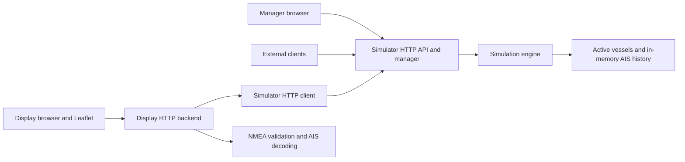

# Separate simulator and display

Status: implemented. The root `README.md` and package `doc.go` files describe
the resulting system; this plan records the design intent and acceptance scope.

## Goal and value

Make AIS Test Bench two independently runnable components:

1. The simulator owns vessel movement, AIS generation, authoritative state,
   recent message storage, its public HTTP API, and the manager page.
2. The display owns its HTTP backend, simulator API client, AIS decoding for
   visualization, and the live Leaflet page.

External clients can consume the simulator's NMEA AIS messages and metadata
without running the display. The display can connect to a simulator in a
different process. A combined command retains convenient local startup.

## Starting point

Before this plan, the repository ran everything through `cmd/ais-test-bench` and
`internal/app.Run`. `internal/ui.NewHandler` owns both pages and all JSON routes,
and keeps a direct `*simulation.Simulator` reference. Display JavaScript fetches
the simulator's decoded coordinates from `/api/vessels`.

`internal/simulation` starts one vessel off Rotterdam, supports 0-100 vessels,
advances movement once per second, and retains 1,000 reports. `internal/ais`
encodes type 1 position reports and validates sentences with go-nmea. There is
no display backend consuming an external simulator API and no metadata endpoint.

Preserve this working scenario during the split. Vessel movement, map styling,
storage capacity, and generation cadence do not need redesign.

## Proposed architecture



The same HTTP data path applies when both components run in one process.
The combined launcher must not pass simulator state to the display or replace
its HTTP client with an in-process shortcut.

### Ownership

| Concern | Owner |
| --- | --- |
| Random initialization, navigation, generation, fleet mutations | Simulator engine |
| Authoritative vessel identity and type assignment | Simulator engine |
| Latest report for every active vessel and bounded history | Simulator engine |
| Metadata, current report snapshot, history, control endpoints | Simulator HTTP backend |
| Vessel count form and recent message viewer | Manager page served by simulator |
| Fetching simulator data and decoding NMEA for map use | Display backend |
| Map markers, labels, connection state, user pan/zoom | Display browser |
| Starting and stopping both component runtimes | Combined launcher |

Shared Go code is limited to protocol data types, AIS codec functions, and
stateless UI rendering/assets. The display never imports simulator state or
runtime packages. Both components pass contexts explicitly.

### Proposed package layout

| Path | Responsibility |
| --- | --- |
| `cmd/simulator` | Parse simulator listen address; run engine, API, and manager |
| `cmd/display` | Parse display address and simulator URL; run display backend and page |
| `cmd/ais-test-bench` | Start both runtimes and coordinate shutdown |
| `internal/simulation` | Existing authoritative engine and memory stores |
| `internal/ais` | Existing encoder plus a small supported-position decoder |
| `internal/simulatorapi` | Shared HTTP request/response types and documented wire contract |
| `internal/simulator` | Simulator HTTP routes, manager composition, and runtime lifecycle |
| `internal/display` | HTTP client, request-time map projection, display routes, and runtime |
| `internal/ui` | Stateless templates, rendering, page-specific navigation, and embedded assets |
| `internal/app` | Combined composition and lifecycle coordination |

Use concrete services. Introduce an interface only when a consumer actually
needs one. Tests can use a real `httptest` server with the concrete HTTP client.
Do not add a generic service host, event bus, repository framework, or dependency
injection framework. Existing unused design contracts need no expansion.

## Runtime modes and routes

Proposed command examples below become valid after implementation.

```text
go run ./cmd/simulator -addr localhost:8000
go run ./cmd/display -addr localhost:8081 -simulator-url http://localhost:8000
go run ./cmd/ais-test-bench -addr localhost:8000
```

| Mode | Public listener | Browser entry points | Simulator connection |
| --- | --- | --- | --- |
| Simulator | `localhost:8000` by default | `/` redirects to `/manager`; `/manager` | Own engine |
| Display | `localhost:8081` by default | `/` redirects to `/display`; `/display` | `-simulator-url`, default `http://localhost:8000` |
| Combined | `localhost:8000` by default | `/` links both pages; `/manager`; `/display` | Internal loopback HTTP listener with an OS-assigned port |

The simulator owns `/api/*`. The display owns `/display/api/*`. This separation
allows both route sets on the combined public listener without ambiguous paths.
Shared `/static/*` assets are mounted once per listener. The simulator retains
its `/status` page; display connection status is returned by its own backend or
shown from a failed data request.

Standalone navigation includes only pages served by that component. The combined
navigation links both pages. No hard-coded link to a missing local manager or
display page should remain in the shared layout.

Combined mode mounts the same simulator API handlers publicly and on a private
`127.0.0.1:0` listener. Both handler mounts use one engine instance. The display
client uses the actual private listener address, independent of the public bind
address. The private listener serves API routes only. This adds one local
listener while retaining the existing combined browser URLs and one public port.

## Data flow and deliberately small scope

The canonical display input is the simulator's latest NMEA report for each
active vessel. Display positions must come from decoding those reports. Names
and type IDs come from snapshot identity data; type labels and settings come
from the metadata API. Full timestamps come from the report envelope because
the supported AIS position payload contains only the UTC second.

Use one-second browser polling. Each display data request makes bounded HTTP
requests to the simulator for a complete current report snapshot and metadata,
decodes them, and returns one complete browser projection. There is no display
background poller or display-owned authoritative state. Multiple browsers share
the engine but can issue their own small snapshot requests.

The current report snapshot is separate from the rolling message history. It
contains one latest report for every active vessel, even if history retention
changes. Replacing the map's active set on each successful snapshot makes fleet
reductions and a zero-vessel state explicit. Historical messages cannot revive
removed vessels.

The first metadata catalog can contain one supported category, `cargo`. Existing
vessels receive that category. This is application metadata; no new AIS static
message type or additional movement behavior is implied. Metadata describes
actual settings; this plan adds only the existing count mutation.

Keep polling, in-memory storage, the existing generation cadence, Leaflet, and
OpenStreetMap. Streaming subscriptions, durable storage, playback, authentication,
TCP/UDP publication, arbitrary AIS message support, and distributed deployment
automation are outside this implementation scope.

## Steps

| Step | Outcome | Dependencies | Effort | Complexity |
| --- | --- | --- | --- | --- |
| [01 - API contracts](01-api-contracts.md) | Concrete NMEA, metadata, and display schemas | None | M | Medium |
| [02 - Engine state and metadata](02-engine-state-and-metadata.md) | Consistent active reports and real metadata | 01 | M | Medium |
| [03 - Simulator component](03-simulator-component.md) | Engine API, manager, and `cmd/simulator` | 01, 02 | M | Medium |
| [04 - Display data backend](04-display-data-backend.md) | HTTP consumption and AIS-derived projections | 01, 03 | L | Medium |
| [05 - Standalone display](05-standalone-display.md) | `cmd/display` and map integration | 04 | M | Medium |
| [06 - Combined launcher](06-combined-launcher.md) | Shared components under existing combined URLs | 03, 05 | M | Medium |
| [07 - Acceptance and documentation](07-acceptance-and-documentation.md) | Verified modes and accurate operating docs | 01-06 | M | Medium |

Effort is relative implementation size, including the tests in each step.
See [assessment](assessment.md) for impact, feasibility, risks, and tradeoffs.
The contract details in step 01 are the source of truth for subsequent steps.

## Overall acceptance

- `cmd/simulator` runs the engine and manager without a display runtime.
- `cmd/display` runs its backend and map without creating a simulation engine.
- The display and an unrelated HTTP client consume the same simulator NMEA API.
- The display's plotted coordinates agree with decoded NMEA within AIS precision.
- Metadata exposes supported vessel categories and effective simulation settings.
- Count changes and live movement reach an already-open display without reload.
- Empty fleets, upstream outages, and simulator restarts have defined behavior.
- `cmd/ais-test-bench` runs both components using the same HTTP client path as
  separate mode, with one engine and coordinated shutdown.
- Tests, formatting, vet, lint, and dead-code checks pass through `task all`
  when the implementation is complete. No commits are created by this work.

## Implementation sequencing

Keep the existing combined path usable while standalone components are built.
Temporary adapters may exist during steps 02-05 and must be removed in step 06.
The repository is in design phase, so the final JSON shape can change without
keeping legacy endpoints or decoded-coordinate compatibility layers. Update all
internal callers and tests in the same implementation sequence.

This plan makes concrete defaults so implementation can proceed without a new
architecture decision. Any later change to routes, command defaults, or polling
semantics must update the contract and affected acceptance criteria together.
